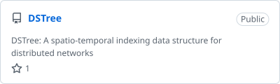
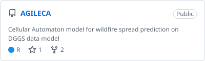
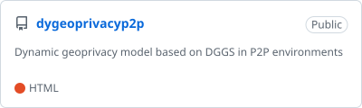

<!-- Generated by am2222.github.io/profile/make_profile.py; edit _config.yml there, not this file. -->

### Discrete Global Grid Systems

<a href="https://github.com/am2222/webDggrid"><picture><source media="(prefers-color-scheme: dark)" srcset="cards/webDggrid-dark.svg"></picture></a>
<a href="https://github.com/am2222/duckdb-dggs"><picture><source media="(prefers-color-scheme: dark)" srcset="cards/duckdb-dggs-dark.svg"></picture></a>

### DuckDB extensions

<a href="https://github.com/am2222/duck_geoarrow"><picture><source media="(prefers-color-scheme: dark)" srcset="cards/duck_geoarrow-dark.svg"></picture></a>
<a href="https://github.com/am2222/duckrouting"><picture><source media="(prefers-color-scheme: dark)" srcset="cards/duckrouting-dark.svg"></picture></a>

### Web mapping & geo backends

<a href="https://github.com/am2222/mapbox-pmtiles"><picture><source media="(prefers-color-scheme: dark)" srcset="cards/mapbox-pmtiles-dark.svg"></picture></a>
<a href="https://github.com/am2222/maplibre-landmarks"><picture><source media="(prefers-color-scheme: dark)" srcset="cards/maplibre-landmarks-dark.svg"></picture></a>
<a href="https://github.com/am2222/express-ogc-api"><picture><source media="(prefers-color-scheme: dark)" srcset="cards/express-ogc-api-dark.svg"></picture></a>
<a href="https://github.com/am2222/strapi-plugin-postgis"><picture><source media="(prefers-color-scheme: dark)" srcset="cards/strapi-plugin-postgis-dark.svg"></picture></a>

### Research

<a href="https://github.com/am2222/DSTree"><picture><source media="(prefers-color-scheme: dark)" srcset="cards/DSTree-dark.svg"></picture></a>
<a href="https://github.com/am2222/AGILECA"><picture><source media="(prefers-color-scheme: dark)" srcset="cards/AGILECA-dark.svg"></picture></a>
<a href="https://github.com/am2222/dygeoprivacyp2p"><picture><source media="(prefers-color-scheme: dark)" srcset="cards/dygeoprivacyp2p-dark.svg"></picture></a>
<a href="https://github.com/am2222/pydggrid"><picture><source media="(prefers-color-scheme: dark)" srcset="cards/pydggrid-dark.svg"></picture></a>

